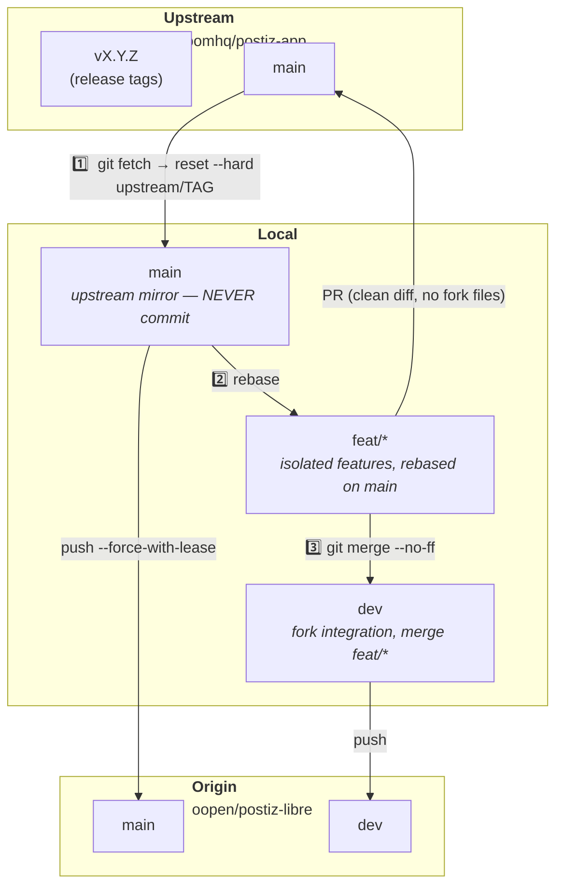

# Project Management — postiz-libre

> Survival guide for maintaining a clean fork, syncable with upstream, and productive.

---

## 🗺️ Branch Architecture



| Branch | Role | Golden Rule |
|--------|------|-------------|
| **`main`** | **Upstream mirror** | No fork-specific commits. Only sync + fast-forward. |
| **`dev`** | **Fork integration** | All fork features merged here. Reference branch for development. |
| **`feat/*`** | **Isolated feature** | One branch = one feature. Rebased on `main` before upstream PR. |

---

## 🧰 Dev Commands (justfile)

All dev lifecycle and pushes go through `just`. Never `git push origin dev` directly.

| Command | Does |
|---------|------|
| `just up` | Start everything (Docker infra + app servers) |
| `just stop` | Stop everything |
| `just app-logs` | Tail app server logs (backend + frontend) |
| `just restart` | Reboot everything |
| `just reset` | Destroy containers + volumes, then fresh start |
| `just purge` | TOTAL PURGE: containers + volumes + images |
| `just build` | Production build in Docker |
| `just build-purge` | Clean build volumes only |
| `just push [branch]` | Build + push branch to origin (default: dev) |
| `just ports` | Show Docker port map |

> **Note for AI assistants**: These commands are for the human maintainer.
> AI is FORBIDDEN from executing any git write operation (commit, push, merge).

---

## 🔄 Sync Workflow

Sync the fork when upstream publishes a new release. This keeps `main`
locked to a stable upstream tag rather than the latest commit on `main`.

### Step 1: Sync `main` to the latest upstream release

```bash
git fetch upstream

# Lock main to the latest upstream release tag (not latest commit)
UPSTREAM_TAG=$(git ls-remote --tags upstream | grep -E 'v[0-9]+\.[0-9]+\.[0-9]+$' | sort -V | tail -1 | sed 's/.*refs\/tags\///')
git checkout main
git reset --hard upstream/$UPSTREAM_TAG
git push origin main --force-with-lease
```

### Step 2: Rebase all branches on `main`

```bash
# Rebase dev
git checkout dev
git rebase main
# Handle conflicts → git add <file> → git rebase --continue

# Rebase feature branches
for branch in $(git branch --list 'feat/*' | sed 's/^[* ]*//'); do
  echo "--- rebasing $branch ---"
  git checkout "$branch" && git rebase main
done
```

### Step 3: Merge features back into `dev`

**Important trap:** After rebase, `git cherry dev feat/xxx` may show "0 commits missing"
because all content is semantically present in `dev`. You MUST still merge with `--no-ff`.
The rebase changed commit SHA, so `dev` does not have them as tracked objects.

```bash
git checkout dev
for branch in $(git branch --list 'feat/*' | sed 's/^[* ]*//'); do
  echo "--- merging $branch ---"
  git merge "$branch" --no-ff
done
```

### Step 4: Push

`--force-with-lease` is required after rebase (commit SHA changed).
The `protect-dev` ruleset blocks `--force` but allows `--force-with-lease`.

```bash
git push origin dev --force-with-lease
for branch in $(git branch --list 'feat/*' | sed 's/^[* ]*//'); do
  git push origin "$branch" --force-with-lease
done
```

### Known conflicts

| File | Pattern | Resolution |
|------|---------|------------|
| `translation.json` | Upstream adds new i18n keys, fork adds AI error keys at same position | Keep both blocks (coupon keys + AI keys) |
| `Dockerfile.dev` | `--frozen-lockfile` (fork) vs `pnpm install` (upstream) | Keep `--frozen-lockfile` |
| `health.controller.ts` | Add/add (identically created on both branches) | `git checkout --theirs <file>` |
| `justfile` | Add/add | `git checkout --theirs <file>` |
| `health/route.ts` | Add/add | `git checkout --theirs <file>` |

---

## 📁 Where Files Live

| File | Branch | Appears in upstream PR? |
|------|--------|------------------------|
| `FORK-README.md` | `dev` | ❌ No |
| `FORK-CHANGELOG.md` | `dev` | ❌ No |
| `FORK-ROADMAP.md` | `dev` | ❌ No |
| `FORK-GIT-WORKFLOW.md` | `dev` | ❌ No |
| `.github/workflows/docker-build.yml` | `dev` | ❌ No |
| `libraries/.../openai.service.ts` (patched) | `feat/unlock-ai-vendor-lockin` | ✅ Yes |
| `docker-compose.dev.yaml` | `feat/compose-improvements` | ✅ Yes |

---

## 🏷️ Release

Releases are cut from `dev`, never from `main`.

### Versioning

| Pattern | Example | Meaning |
|---------|---------|---------|
| `vX.Y.Z-libre` | `v2.22.1-libre` | First libre release on upstream v2.22.1 |
| `vX.Y.Z-libre-N` | `v2.22.1-libre-2` | Third libre release, same upstream patch |

Docker floating tags are independent — e.g. `v2.22-libre` always points to the latest `v2.22.x-libre`.

Docker tags are published automatically by CI:
`v2.22-libre` (exact), `v2.22-libre` (latest minor), `v2-libre` (latest major), `latest`.

### Release checklist

```bash
# 1. Find the latest upstream patch tag for the current minor
UPSTREAM_TAG=$(git ls-remote --tags upstream \
  | grep -E 'refs/tags/v[0-9]+\.[0-9]+\.[0-9]+$' \
  | sed 's/.*refs\/tags\///' \
  | sort -V | tail -1)

# 2. Derive libre tag (append -libre suffix)
LIBRE_TAG="${UPSTREAM_TAG}-libre"

# 3. Tag and push (CI builds + pushes Docker image automatically)
git tag -a "$LIBRE_TAG" -m "Release $LIBRE_TAG — based on upstream $UPSTREAM_TAG"
git push origin dev --tags
```

---

## 🐳 Docker image

```bash
# Pull the latest image
docker pull ghcr.io/oopen/postiz-libre:latest

# Pull a specific tag
docker pull ghcr.io/oopen/postiz-libre:dev
docker pull ghcr.io/oopen/postiz-libre:v2.22-libre

# Build locally
docker build -f Dockerfile.dev --target prod -t postiz-libre:local .
```

Images are built automatically on push to `dev` and on `v*-libre` tags.
Available at [github.com/oopen/postiz-libre/pkgs/container/postiz-libre](https://github.com/oopen/postiz-libre/pkgs/container/postiz-libre).

---

## 🆘 Troubleshooting

### "Cannot fast-forward main onto upstream"

```bash
# You accidentally committed on main
# Save the commit
git checkout main
git log --oneline -3

# Create a temporary branch
git branch temp-save <commit-hash>

# Reset main to upstream
git reset --hard upstream/main
git push --force-with-lease origin main

# Move the commit to dev
git checkout dev
git cherry-pick <commit-hash>
just push
```

### "Feature rebase creates conflicts"

```bash
git status
# Edit conflicted files
git add <files>
git rebase --continue

# If too broken:
git rebase --abort
```

---

## 📋 Upstream PR Checklist

- [ ] `git fetch upstream` done
- [ ] `main` is up to date (`git merge upstream/main --ff-only`)
- [ ] Feature is rebased on `main`
- [ ] PR contains ONLY the feature commits
- [ ] Tests pass / Docker build OK

## 📋 Libre Release Checklist

- [ ] `main` synced with upstream
- [ ] `dev` rebased on `main`
- [ ] All features merged into `dev`
- [ ] Docker build OK
- [ ] Tag format `vX.Y.Z-libre`

---

*Document for postiz-libre — July 2026*
